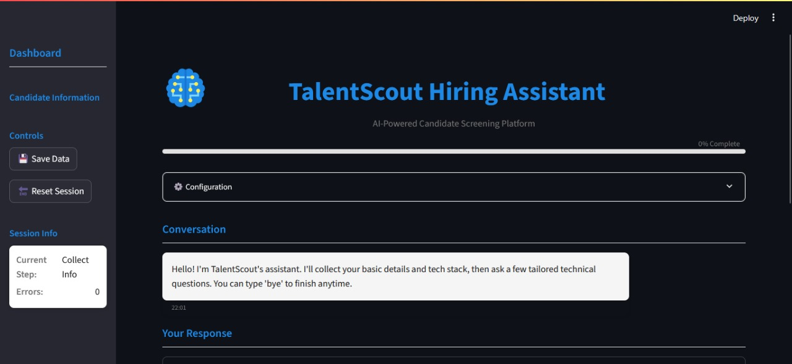

# 🚀 TalentScout Hiring Assistant

<div align="center">
  
  <h1 style="color: #1E88E5;">TalentScout Hiring Assistant</h1>
  <p style="color: #757575; font-size: 1.2rem;">AI-Powered Candidate Screening Platform</p>
  
  [](https://python.org)
  [](https://streamlit.io)
  [](https://langchain.com)
  [](https://groq.com)
  [](LICENSE)
  [](https://github.com/yourusername/talentscout-hiring-assistant)
</div>

---

## 📖 Table of Contents
- [About](#about)
- [Features](#features)
- [Screenshots](#screenshots)
- [Installation](#installation)
- [Usage](#usage)
- [Technical Details](#technical-details)
- [Project Structure](#project-structure)
- [Contributing](#contributing)
- [License](#license)
- [Acknowledgments](#acknowledgments)

---

## 🌟 About

TalentScout Hiring Assistant is an intelligent chatbot designed to streamline the initial screening process for technology job candidates. Powered by advanced AI and natural language processing, it conducts conversational interviews to gather candidate information and assess technical proficiency through tailored questions.

### 🎯 Mission

To revolutionize the recruitment process by providing an efficient, unbiased, and engaging initial screening experience for both candidates and recruiters.

---

## ✨ Features

### 🤖 AI-Powered Conversations
- **Natural Language Processing**: Engage in human-like conversations with candidates
- **Context Awareness**: Maintain conversation context for coherent interactions
- **Multilingual Support**: Communicate in multiple languages (coming soon)

### 📝 Information Gathering
- **Comprehensive Profile Collection**: Gather name, contact details, experience, and preferences
- **Tech Stack Analysis**: Extract and categorize technical skills automatically
- **Resume Parsing**: Intelligently parse and extract information from uploaded resumes

### 🧠 Technical Assessment
- **Dynamic Question Generation**: Create tailored technical questions based on candidate's tech stack
- **Adaptive Difficulty**: Adjust question complexity based on experience level
- **Multi-Technology Support**: Cover programming languages, frameworks, databases, and tools

### 🔒 Privacy & Security
- **Data Anonymization**: Protect sensitive candidate information
- **Consent Management**: Explicit consent for data storage and processing
- **Compliance**: GDPR and data privacy regulation compliant

### 📊 Analytics & Insights
- **Candidate Scoring**: Automatic scoring based on responses (coming soon)
- **Skill Assessment**: Detailed analysis of technical proficiency (coming soon)
- **Reporting**: Generate comprehensive candidate reports (coming soon)

---

## 📸 Screenshots

### Main Interface
<div align="center">
  
  <p><em>Clean and intuitive user interface with real-time conversation</em></p>
</div>
---

## 🛠️ Installation

### Prerequisites

- Python 3.8 or higher
- Groq API key (sign up at [Groq](https://groq.com/))
- Git (for cloning the repository)

### Step-by-Step Installation

1. **Clone the Repository**
   ```bash
   git clone https://github.com/FaheemKhan0817/TalentScout-Hiring-Assistant.git
   cd talentscout-hiring-assistant
   ```

2. **Create Virtual Environment**
   ```bash
   python -m venv venv
   source venv/bin/activate  # On Windows: venv\Scripts\activate
   ```

3. **Install Dependencies**
   ```bash
   pip install -r requirements.txt
   ```

4. **Set Up Environment Variables**
   Create a `.env` file in the project root:
   ```env
   GROQ_API_KEY=your_groq_api_key_here
   MODEL_NAME=llama3-70b-8192
   MODEL_TEMPERATURE=0.2
   DATA_DIR=data
   ENABLE_RATE_LIMITING=true
   RATE_LIMIT_REQUESTS=10
   RATE_LIMIT_PERIOD=60
   LOG_LEVEL=INFO
   LOG_FILE=logs/talentscout.log
   RETENTION_DAYS=90
   ```

5. **Create Necessary Directories**
   ```bash
   mkdir -p data logs
   ```

6. **Run the Application**
   ```bash
   streamlit run app.py
   ```

7. **Access the Application**
   Open your web browser and navigate to `http://localhost:8501`

---

## 💻 Usage

### Getting Started

1. **Initial Setup**
   - Launch the application using the command above
   - Review the configuration settings in the sidebar
   - Provide consent for data storage (optional)

2. **Candidate Interaction**
   - The chatbot will greet the candidate and explain the process
   - Follow the conversational flow to provide information
   - Answer technical questions based on your expertise

3. **Conversation Flow**
   ```
   Greeting → Basic Info → Experience → Position → Location → Tech Stack → Technical Questions → Conclusion
   ```

### Key Interactions

#### Providing Information
- **Basic Information**: Name, email, phone number
- **Professional Details**: Years of experience, desired positions
- **Location**: Current city/country
- **Tech Stack**: Programming languages, frameworks, databases, tools

#### Technical Assessment
- **Question Generation**: 3-5 questions per technology in your tech stack
- **Answer Format**: Detailed responses demonstrating your knowledge
- **Follow-up Questions**: Contextual questions based on your answers

### Tips for Candidates
- Provide detailed and accurate information
- Be thorough in your technical explanations
- Use specific examples from your experience
- Feel free to ask clarifying questions

---

## 🔧 Technical Details

### Architecture Overview

```
┌─────────────────┐     ┌──────────────────┐     ┌─────────────────┐
│   Frontend UI   │────▶│  Backend Logic   │────▶│  LLM (Groq)     │
│  (Streamlit)    │     │  (Python)        │     │                 │
└─────────────────┘     └──────────────────┘     └─────────────────┘
                                │
                                ▼
                       ┌─────────────────┐
                       │  Data Storage   │
                       │ (JSON/Database) │
                       └─────────────────┘
```

### Core Components

#### 1. Conversation Engine
- **State Management**: Tracks conversation progress and context
- **Flow Control**: Manages the sequence of information gathering
- **Error Handling**: Graceful recovery from unexpected inputs

#### 2. Information Extraction
- **Natural Language Processing**: Extracts entities from user input
- **Resume Parsing**: Processes uploaded resumes for information extraction
- **Validation**: Ensures data integrity and format compliance

#### 3. Question Generation
- **Dynamic Prompts**: Creates context-aware technical questions
- **Technology Mapping**: Maps skills to relevant question categories
- **Difficulty Scaling**: Adjusts complexity based on experience level

#### 4. Data Management
- **Anonymization**: Protects sensitive candidate information
- **Retention Policies**: Manages data lifecycle and deletion
- **Export Capabilities**: Enables data export for analysis

### Technology Stack

| Category | Technology | Purpose |
|-----------|-------------|---------|
| **Frontend** | Streamlit | Interactive web interface |
| **Backend** | Python 3.8+ | Core application logic |
| **NLP Framework** | LangChain | LLM integration and prompt management |
| **Language Model** | Groq (LLaMA) | Natural language understanding and generation |
| **Data Storage** | JSON Files | Candidate data storage |
| **Configuration** | Pydantic Settings | Environment and application settings |
| **Logging** | Python Logging | Debugging and monitoring |

### API Integration

#### Groq API Configuration
```python
from langchain_groq import ChatGroq

llm = ChatGroq(
    model="llama3-70b-8192",
    temperature=0.2,
    max_tokens=None,
    api_key=os.getenv("GROQ_API_KEY"),
)
```

#### Prompt Engineering
```python
TECH_QUESTION_PROMPT = ChatPromptTemplate.from_messages([
    ("system", "You generate practical, role-relevant technical questions. Return JSON only."),
    ("user", """
    Candidate tech stack (JSON):
    {tech_stack}
    Generate exactly 3 concise questions per technology. Output JSON:
    {{"questions":[{{"topic":"<tech>","questions":["q1","q2","q3"]}}]}}
    """),
])
```

---

## 📁 Project Structure

```
talentscout-hiring-assistant/
├── talentscout/                    # Main application package
│   ├── __init__.py
│   ├── chains.py                   # LangChain integration
│   ├── config.py                   # Configuration management
│   ├── data_handler.py             # Data storage and privacy
│   ├── logger.py                   # Logging configuration
│   ├── memory.py                   # Conversation memory
│   ├── prompts.py                  # Prompt templates
│   ├── schema.py                   # Data models
│   ├── security.py                 # Security utilities
│   └── utils.py                    # Helper functions
├── data/                          # Data storage directory
├── logs/                          # Log files directory
├── .env                           # Environment variables
├── .gitignore                     # Git ignore rules
├── app.py                         # Main application
├── requirements.txt                # Python dependencies
├── style.css                      # Custom styles
├── README.md                      # This file
└── LICENSE                        # MIT License
```

### Key Files Description

| File | Description |
|------|-------------|
| `app.py` | Main Streamlit application with UI and business logic |
| `talentscout/chains.py` | LangChain integration for LLM interactions |
| `talentscout/prompts.py` | Prompt templates for various interactions |
| `talentscout/schema.py` | Pydantic models for data validation |
| `talentscout/data_handler.py` | Data storage with privacy protection |
| `talentscout/security.py` | Security utilities and input validation |
| `style.css` | Custom CSS for enhanced UI styling |

---

## 🤝 Contributing

We welcome contributions to improve TalentScout Hiring Assistant! Please follow these guidelines:

### Development Workflow

1. **Fork the Repository**
   ```bash
   # Fork on GitHub and clone locally
   git clone https://github.com/FaheemKhan0817/TalentScout-Hiring-Assistant.git
   cd talentscout-hiring-assistant
   git remote add upstream https://github.com/FaheemKhan0817/TalentScout-Hiring-Assistant.git
   ```

2. **Create a Feature Branch**
   ```bash
   git checkout -b feature/amazing-feature
   ```

3. **Make Your Changes**
   - Follow the existing code style
   - Add tests for new functionality
   - Update documentation as needed

4. **Commit Your Changes**
   ```bash
   git add .
   git commit -m "feat: Add amazing feature"
   ```

5. **Push to Your Fork**
   ```bash
   git push origin feature/amazing-feature
   ```

6. **Create a Pull Request**
   - Provide a clear description of your changes
   - Link to any relevant issues
   - Ensure all tests pass

### Coding Standards

- **Python**: Follow PEP 8 guidelines
- **Documentation**: Include docstrings for all functions and classes
- **Testing**: Write unit tests for new functionality
- **Comments**: Explain complex logic where necessary

### Reporting Issues

Please use the GitHub Issues page to report bugs or request features. Include:

- Clear description of the issue
- Steps to reproduce
- Expected behavior
- Actual behavior
- Screenshots if applicable

---

## 📄 License

This project is licensed under the MIT License - see the [LICENSE](LICENSE) file for details.

### License Summary
- ✅ Commercial use
- ✅ Modification
- ✅ Distribution
- ✅ Private use
- ❌ Warranty
- ❌ Liability

---

## 🙏 Acknowledgments

We would like to express our gratitude to the following projects and communities:

### Technologies & Frameworks
- [Streamlit](https://streamlit.io/) for the amazing web framework
- [LangChain](https://langchain.com/) for the LLM integration framework
- [Groq](https://groq.com/) for providing fast LLM inference
- [Pydantic](https://pydantic-docs.helpmanual.io/) for data validation
- [Python](https://www.python.org/) for the powerful programming language

### Inspiration & Resources
- OpenAI's GPT models for inspiration in conversational AI
- The AI and ML community for continuous innovation
- HR technology professionals for domain expertise

### Contributors
- A special thanks to all contributors who have helped improve this project

---

## 📞 Contact

For questions, suggestions, or collaboration opportunities:

- **Email**: faheemthakur23@gmail.com
- **GitHub Issues**: [Create an issue](https://github.com/FaheemKhan0817/TalentScout-Hiring-Assistant.git/issues)
- **Discussions**: [Join our discussions](https://github.com/FaheemKhan0817/TalentScout-Hiring-Assistant.git/discussions)

---

<div align="center">
  <p style="color: #757575; font-size: 0.9rem;">
    Made with ❤️ by the TalentScout team
  </p>
  <p style="color: #757575; font-size: 0.8rem;">
    Star this repository if you find it helpful!
  </p>
  
  [](https://star-history.com/#FaheemKhan0817/talentscout-hiring-assistant&Date)
</div>
```
